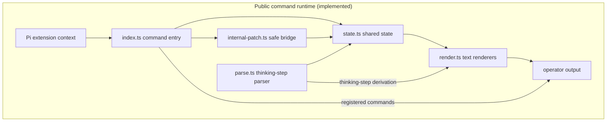
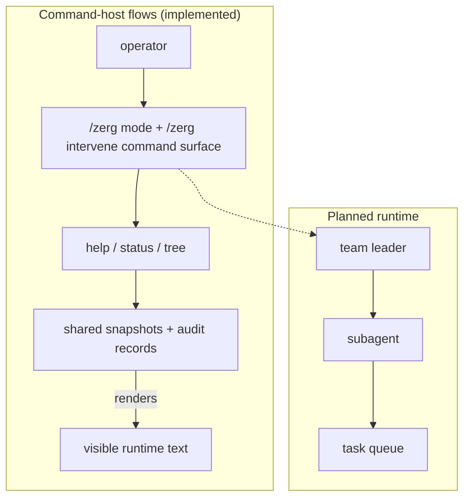

# pi-zerg-swarm

`pi-zerg-swarm` is a Pi coding-agent extension for native configurable agent teams, direct structured control, and zerg-style subagent orchestration. It is **not** a Raspberry Pi hardware swarm project.


> **v1.1.15 release status**
> Adds bounded declarative **read-only workflows** on the existing native runner: dependency scheduling, parallel reviews, verification/reporting, explicit retries, and a separate progress monitor.
> Restart restores inspectable history, not execution or authority. There is no automatic replay, second transcript store, workspace restoration, or OS sandbox.

## Release status

- Current release: **v1.1.15** (minimal declarative read-only workflows).
- Historical milestones preserved for audit traceability: v0.8.0 implementation milestone and v0.8.1 audit follow-up patch.
- Mandatory RC audits for the release path: `prompts/audit/generalized-deep-audit_v2-0-0.md`, `prompts/audit/milestone-audit_v2-0-0.md`, `prompts/audit/security-audit_v2-0-0.md`, `prompts/audit/performance-audit_v2-0-0.md`, `prompts/audit/hardening-sweep_v2-0-0.md`, and `prompts/audit/themed-cleanup_v2-0-0.md`.
- Canonical repository metadata is configured for the public repo: https://github.com/fluxgear/pi-zerg-swarm.

## Pi compatibility

Tested with **Pi 1.0.0** (`@earendil-works/pi-coding-agent` and `@earendil-works/pi-tui`). Requires **Node.js 22.19.0 or newer**, matching the current Pi host requirement.

Pi supplies its SDK and TUI libraries to installed extensions. They are declared as host-provided peer dependencies, with Pi 1.0.0 development dependencies for local checks, rather than bundled runtime copies. Native runs use Pi's `ModelRuntime` for model selection and credentials.

## Commands

- `/zerg` — canonical command
- `/zerg-swarm` — alias
- `/swarm` — alias

At v1.1.0 these commands display help, status, expanded tree visibility, deterministic thinking-step parser output, Claude Code-style runtime agent-definition configuration, native Pi SDK-backed run execution, task-first subagent spawn state, explicit fresh/fork launch-mode metadata, command-host permission queue state, fine-grained lifecycle substate hints, bounded structured log/output inspection, restart-durable run/log recovery snapshots, process-lifetime background run status/interrupt/message support, and a componentized Pi-native interactive management TUI for live tree/detail/settings/chat/footer management views through snapshot-safe shared-state-backed Pi command handlers.
Command-host control grammar is available via `/zerg mode status|manual|assisted|automatic|revert [reason]`, `/zerg intervene agent|subagent|leader ...`, `/zerg agents list|show|create|update|delete` with per-agent `--model`, `--fallback-models`, `--max-turns`, tools, and permission settings, `/zerg agent`/`/zerg team` lifecycle configuration flags for team leaders/members/model metadata, `/zerg runs list|show <run-id>`, `/zerg permission status|list|request|approve|deny|cancel`, `/zerg logs status|list|show|json`, `/zerg config`, and `/zerg run <agent-or-team> <task> [--bg] [--fresh|--fork] [--model <model>]`; `/zerg run` does not require `pi-subagents` and uses the native Pi SDK runner when no slash bridge responds.

`/zerg config` is intended to stay simple: **Select** an agent/team/task, use **Settings** for mode/read-only/controller/permissions, and use **Message** to record an operator intervention. Press **v** in the tree/detail pane for the separate coding overlay, or **t** on a team/run for its timeline. The explicit live composer is distinct from the management intervention history. The overlay uses Pi theme colors when available and keeps the current key hints visible in the footer.

## Direct automation API

Automation should prefer structured control over terminal automation:

```ts
import { createZergControl } from 'pi-zerg-swarm';

const control = createZergControl({}, { persistence: { enabled: true, rootDir: process.cwd() } });
await control.execute({ action: 'agents.create', id: 'worker', prompt: 'Work directly.' });
const run = await control.execute({ action: 'run', agent: 'worker', task: 'Investigate', background: true });
const status = await control.execute({ action: 'runs.show', runId: run.runId! });
```

`registerZergSwarmExtension(...)` also registers a Pi custom tool named `zerg_control` when the installed Pi extension API exposes `registerTool(...)`. The tool calls the same structured control core and returns JSON-compatible `details`; callers do not need to parse slash-command output. Slash commands remain the human-facing wrapper.

Background jobs are inspectable through `/zerg runs`, `/zerg logs`, direct `runs.*`/`logs.list`, and `/zerg interrupt`/`{ action: 'interrupt' }` while the Pi process/session remains alive. v1.1.0 also supports opt-in durable snapshots under `.pi/zerg-swarm/v1/state.json` through `persistence: { enabled: true, rootDir }`, so restart can recover run/log history and mark previously active sessions as `needs-attention` instead of losing them.

Snapshots have a **64 MiB serialized UTF-8 byte limit**. Loading uses a verified regular-file descriptor and bounded reads, including a growth check; oversized or invalid inputs report `lastLoadError` without modifying the file or replacing current state. Oversized saves are rejected before temporary-file creation, leaving the previous snapshot intact. Exclusive temporary files and failure cleanup protect against pre-existing temporary-file collisions. A currently enabled read-only setting remains enabled after recovery, even if the saved state was writable.

Valid snapshot symlinks to regular files retain their existing load behavior; missing/dangling links behave as missing snapshots. Saving still atomically replaces the configured path itself, **not the symlink target**. This is not filesystem confinement, multi-writer coordination, or fsync/power-loss protection; use one owner per snapshot file. The separate native JSONL viewer limits remain unchanged.

If an external adapter throws during launch, execution may already have started. Zerg preserves observed terminal state or reports `needs-attention` with the original run/task identities; inspect manually rather than automatically retrying. Admission checks do not revoke capabilities from an already-running external adapter.

## Declarative read-only workflows

Workflows coordinate native single-agent units outside the parent conversation. They reuse existing agent definitions, run/task/Pi identities, logs, coding views, cancellation, and opt-in snapshots. There is no separate agent runtime, transcript mirror, daemon, or model-driven scheduler. Background execution lasts only while its owning Pi process is alive.

### Start the review preset

The built-in `read-only-review` performs discovery → parallel reviews → finding collection → independent verification → deduplicated report. It uses the existing `generalist` definition for discovery and `reviewer` for review/verification. First configure **explicit, available provider/model IDs** on those definitions; replace the placeholders below. Unsupported turn limits, fallback models, and permission overrides must be cleared.

```text
/zerg agents update generalist --model provider/model
/zerg agents update reviewer --model provider/model
/zerg workflows start {"definitionId":"read-only-review","inputs":{"candidatePaths":["index.ts"],"scope":"Review the supplied source without changing files"},"concurrency":8}
/zerg workflows monitor
```

The preset accepts 1–16 unique normalized relative candidate paths and a nonempty scope. Discovery may select only those candidates; each target produces at most two findings, with at most 32 verifications. Failed reviews, missing/mismatched/duplicate verifier IDs, disagreement, and unselected coverage remain visible. Partial coverage is **not** overall success. Verdicts are model evidence, not proof that findings are true.

Use structured `zerg_control` or `control.execute(...)` for automation:

| Action | Required fields / meaning |
| --- | --- |
| `workflows.list` | Compact definition/attempt summaries; no intermediate results or per-unit identity dump |
| `workflows.define` | `definition`: validated version-1 graph; replaces a name only when its prior work is settled |
| `workflows.show` | Exactly one of `definitionId` or `workflowRunId`; attempt view includes exact unit/native correlations |
| `workflows.start` | `definitionId`, `inputs`, optional `concurrency`; returns a fresh `data.view.workflowRunId` |
| `workflows.pause` / `workflows.resume` | `workflowRunId`; pause blocks new admission, not already-admitted work |
| `workflows.cancel` | `workflowRunId`; requests owned cancellation promptly, even after control becomes read-only |
| `workflows.retry` | `workflowRunId`; explicit new attempt in the same family, not in-place replay |
| `workflows.report` | `workflowRunId`; explicitly retrieves the final report, when available |
| `workflows.forget` | `workflowRunId`; explicitly removes a terminal, cleanup-settled workflow record, not its native history |

Slash equivalents use `/zerg workflows list`, `define <JSON>`, `start <JSON>`, `show {"workflowRunId":"..."}` (or `definitionId`), and `pause|resume|cancel|retry|report|forget <workflow-run-id>`. `/zerg workflows monitor [workflow-run-id]` adds the interactive view; aliases remain supported and noninteractive inspection does not require a TUI.

In the monitor, **Enter** drills from attempts to steps to units to an explicitly selected bounded result. **p** pauses/resumes, **x** cancels the whole selected workflow, and **r**, then **Enter on the rendered confirmation**, starts a new retry attempt. **c** opens the selected unit's exact native coding view; returning creates a fresh monitor instance. **q/Esc/Ctrl+C** closes the view, not the workflow. Stale selection cannot retarget an action. Active workflow units reject steer/follow-up messages to preserve frozen inputs; ordinary native messaging is unchanged.

### Define a small graph

Definitions are plain JSON, never executable code. For example, with an explicitly configured `reviewer`:

```ts
import type { WorkflowDefinition } from 'pi-zerg-swarm';

const definition: WorkflowDefinition = {
  id: 'review-one', version: 1, label: 'One read-only review',
  inputSchema: {
    type: 'object', additionalProperties: false, required: ['target'],
    properties: { target: { type: 'string', maxLength: 512 } },
  },
  steps: [{
    id: 'review', kind: 'native', agentId: 'reviewer', dependsOn: [],
    prompt: 'Read target without changes. Return ONLY a JSON string summarizing evidence.',
    inputs: { target: { ref: { source: 'inputs', path: ['target'] } } },
    outputSchema: { type: 'string', maxLength: 8192 },
  }],
};
await control.execute({ action: 'workflows.define', definition });
await control.execute({ action: 'workflows.start', definitionId: definition.id, inputs: { target: 'index.ts' } });
```

- Steps have unique IDs and explicit `dependsOn` edges. Cycles, unknown references, unsupported fields, and excessive graphs are rejected before admission.
- Input bindings are `{ value: <JSON> }` or `{ ref: { source: 'inputs' | 'step' | 'item', path: [...], stepId?: 'dependency-id' } }`. Step references must name explicit dependencies. Paths into single native results are schema-checked; fan-out/aggregate results are referenced as whole envelopes.
- Native steps may declare `fanout: { from: <reference>, maxItems: N }` over a bounded array. There are no arbitrary loops, conditions, JavaScript, shell steps, teams, forks, or nested delegation.
- Deterministic aggregate steps use `kind: 'aggregate'`, `operation: 'collect' | 'collect-findings' | 'review-report'`, and input bindings. Only aggregates can explicitly set `consumeFailures: true`; otherwise unsuccessful dependencies skip downstream work. Review-specific aggregates expect the preset's envelope shapes.
- The schema subset supports closed objects, required properties, bounded arrays/strings, numbers/integers, booleans, null, and finite enums. No external references or regex/evaluation language. `maxLength` uses JavaScript string length; independent UTF-8 byte limits also apply.

### Authority, bounds, retries, and recovery

- Each attempt freezes its definition, declared JSON inputs, agent definitions, and explicit model selections. Relevant current-agent/model/tool drift fails closed. Effective tools are the definition's expanded tools minus denials, **intersected with `read`, `grep`, `find`, `ls`**; an empty intersection is refused. Broad definitions are restricted, not silently granted new tools. Replacement builtins and dynamically activated gateways are refused.
- Starting work authorizes normal current Pi resources and hooks. Outputs/source text remain data, not permission. Read-only tools are not filesystem confinement or an OS sandbox, and trusted extensions are not universally certified. Zerg's read-only **control mode** blocks new workflow execution; it is separate from the workflow's read-only tool policy.
- Limits: **16 steps**, **32 fan-out items**, concurrency **1–32** (default **8**), **3 attempts** and at most **256 native admissions per family**. Graph validation budgets all three attempts. An owner also shares a conservative ceiling no greater than its most restrictive unsettled workflow's concurrency; this is not a provider-wide limit.
- A permit covers native setup, execution, and owned cleanup—not just the final answer. Pause does not free active permits; cancel may remain `cancelling`. Missing/uncertain cleanup is `needs-attention`, blocks further admission/retry, and is not represented as successful disposal. Unit states distinguish completed, failed, cancelled, skipped, and unverified work.
- UTF-8 limits: definition **64 KiB**, start inputs **32 KiB**, resolved workflow prompt/input **256 KiB**, raw native unit result **16 KiB before JSON parsing**, aggregate **256 KiB**. The **entire workflow namespace** (registry plus retained runs) is capped at **2 MiB**, with at most **16 definitions / 16 retained attempts**. Complexity limits also apply. Overflow is explicit; results are not silently clipped and history is not automatically pruned. Normal Pi resource context and native JSONL have separate limits; these are not token budgets.
- Retry requires a fully settled failed/cancelled latest attempt and unchanged frozen identities. It creates a new workflow run with the same family, incremented attempt number, and `retryOf`; only matching completed units are reused, retaining their original native identities. Newly executed units receive fresh task/run/Pi identities. There is no automatic retry, permission replay, or exactly-once guarantee.
- Frozen inputs are **not a filesystem snapshot**. Reused results describe their original observations; after workspace changes, start a new workflow rather than assume cached results are fresh. Retry cannot replace inputs; changed inputs require a new run.
- Workflow state uses the existing `extensions.workflows` snapshot namespace. Without opt-in persistence it is process-local. Recovery never starts work, reconnects SDK sessions, or replays messages; interrupted work is marked unverified/`needs-attention` and cannot simply resume or retry with unknown cleanup. Corrupt workflow data is retained and workflow actions fail closed without suppressing unrelated run recovery. Snapshot persistence retains its existing error/durability limitations.

## Native session reference foundation

Native runs expose `nativeSessions` through existing structured `runs.list` / `runs.show` results and a bounded `/zerg runs show <run-id>` summary. The parent run's `metadata.nativeSessions` is the canonical ledger; typed results are isolated copies. Each schema-version-1 reference maps the exact parent/member run and agent definition to Pi's own session ID, file locator, cwd, creation timestamp, and attachment state. Team workers and the leader have separate references; simultaneous runs of the same definition are separate conversations.

Before extension binding or prompting, each native Pi manager receives a namespaced `pi-zerg-swarm/native-session/v1` custom identity entry and session name. Custom identity is tree metadata, not model context. Pi owns the JSONL transcript and branching/compaction format; Zerg does not duplicate it. **The SDK allocates the ID/path before writing a file**: setup/custom entries alone do not create a transcript, and a file can be absent after startup failure or cancellation before prompting. A locator is not proof of existence, persistence, or permission to read that path.

Sessions still dispose after each task. `disposed` means confirmed SDK cleanup, not lost history; a throwing cleanup leaves the reference `unavailable` without claiming disposal. With opt-in Zerg snapshot persistence enabled, the ledger survives restart; restored `attached` references become `unavailable`, even for terminal parent runs, without inventing disposal. `unavailable` does not mean reconnected. With persistence disabled, Pi's marker/history survives independently **once Pi actually writes its file**, but Zerg does not rediscover the mapping on restart.

Session runtimes still end after their tasks. Reference inspection and hydration do not read, create, repair, or scan transcript files. Explicit viewing is separate and validates the known location, Pi header, immutable provenance, and entry graph; it never resumes execution or changes the active branch.

## Agent coding overlay

- `/zerg sessions [parent-run-id]` opens an **exact-session chooser** in an interactive Pi TUI. No leader or operator conversation is selected implicitly. `/zerg sessions list [parent-run-id]` prints bounded references and also works without a terminal UI; command aliases are preserved.
- Select a row and press **Enter** to inspect live text, available thinking text, and tool arguments/results. **Home** exposes full parent/member/Pi IDs. **Up/Down**, **PageUp/PageDown**, and **Home** pause tail following; **End** follows the tail on the live default branch. **s** returns to sessions, **b** chooses a raw branch locally (choose **Default** to return), and **q/Esc** closes when not composing.
- `live` means an observer is connected to this owner's native runtime. An already-open viewer becomes `captured` when observation ends: its bounded final display remains, without claiming a durable file or reconnection. Reopening reads `saved` history when validation succeeds; `unavailable` explains missing, unsupported, unsafe, or disconnected state. A saved history from an unconfirmed attachment is explicitly history-only, not a live or confirmed-closed session.
- This is **raw branch history, not effective model context**. Compaction/context-edit records are notices, not reconstructed model context. Saved history defaults to the last recorded entry, which is not proof of the active leaf. Branch selection never navigates or mutates the native session.
- Pi JSONL is the sole transcript store. Reads are limited to known, regular, non-symlink v3 files under the configured Pi agent session directory, with matching header and provenance. Missing/corrupt/partial/oversized files are not repaired or opened through `SessionManager.open`; no directories are created or transcripts scanned. Moving a file or changing the agent directory can make its reference unavailable.
- Views are bounded: saved inputs allow up to 8 MiB, 256 KiB per line, and 10,000 entries; normalized display retains up to 200 blocks with aggregate and per-field limits. Live tool previews can be shorter than finalized results. UI line/text limits and omission notices are explicit. Images, opaque payloads, and thinking signatures are omitted; terminal controls are stripped.
- Closing/switching a viewer unsubscribes only that viewer. Runs, native persistence, concurrency slots, cancellation, and task-final SDK disposal retain their existing ownership. There is no transcript tool action, automatic prompt/replay/resume, active-branch mutation, or retained completed SDK session.

### Explicit live messages and receipts

On an exact, accepting **live default branch**, press **c** to compose. **Enter** inserts a newline; **Ctrl+S** explicitly sends; **Alt+M** selects `followUp` (default) or `steer`. **Esc** leaves composition while retaining the draft; another Esc closes the viewer. Pi's public editor handles text editing and normalizes pasted newlines/tabs. Drafts are bounded to 16,384 UTF-16 code units; unsafe/oversized paste packets are rejected visibly. Composition is disabled below 12 columns or 10 rows. Saved, captured, disconnected, completed, read-only, and explicitly selected historical branches cannot send.

Messages target the exact `{parentRunId, memberRunId, piSessionId}` in this owner, never a guessed leader or another run of the same definition. `steer` enters at the next steering boundary; `followUp` waits for current tool/steering work to drain. Literal message content uses Pi's public custom-message queue, bypassing slash commands, templates, and input handlers. Receipt metadata stays outside model context. Closing the viewer does not cancel an already submitted message or the run.

The additive control actions also work without a TUI:

```ts
const key = { parentRunId, memberRunId, piSessionId }; // exact chosen reference
await control.execute({ action: 'session.message.send', ...key,
  messageId: 'operator-unique-001', body: 'Check the failing test first.', mode: 'followUp' });
await control.execute({ action: 'session.messages.list', ...key, limit: 32 });
```

Equivalent slash commands (aliases remain supported):

```text
/zerg sessions send <parent> <member> <pi-id> <message-id> <steer|followUp> -- <literal body>
/zerg sessions messages <parent> <member> <pi-id> [limit]
```

Send mode is explicit in the new API/CLI. The body after the `-- ` separator is literal, including legal tabs, newlines, indentation, and trailing whitespace; shell-style quotes are not removed. Responses expose `data.receipt` or `data.receipts`. The existing `message` action and management intervention history are unchanged.

| Receipt | Meaning |
| --- | --- |
| `recorded` | Local intent recorded; not native acceptance. |
| `queued` | Native queue accepted it; consumption is not yet confirmed. |
| `delivered` | ID-correlated native `message_start` consumption observed—not provider acknowledgement, understanding, completion, or transcript durability. |
| `failed` | Rejected before native enqueue. |
| `needs-attention` | Enqueue/consumption is uncertain, or a pending receipt survived detachment/restart. |

A caller ID is unique across the retained ledger. Repeating the same ID with the same exact key/body/mode returns its receipt without sending again; conflicting reuse rejects. The composer keeps its attempt ID for an unchanged unconfirmed draft. **There are no automatic retries or restart replays.** A deliberately new ID is a new message, not a safe retry of an uncertain one.

Receipt persistence is independently `memory`, `saved`, or `failed`. With existing opt-in snapshot persistence, a successful intent write is required before enqueue; a later save failure does not revoke known queued/delivered status. `saved` means a successful Zerg snapshot write—not fsync/power-loss protection or a durable native transcript. Recovery quarantines pending receipts as `needs-attention` without scanning history, reconnecting, or executing anything. Use one owner per snapshot file; this is not a cross-process mailbox.

The ledger retains at most 128 receipts and 262,144 aggregate body UTF-16 code units, with at most 32 pending per exact session. Capacity exhaustion rejects new messages instead of silently evicting idempotency records; there is no automatic pruning. The overlay shows at most eight receipts; structured listing supports limits 1–128. Outgoing intent bodies are stored for inspection/idempotency, not as a second conversation transcript. Long-lived agents and automatic sibling push/wakeup remain separate work.

## New task from saved native history

Continuation creates a **new task and native Pi session** using an explicitly selected saved history entry as context. It does not reconnect to, resume in place, or modify the original session. Only the selected agent continues—not its former team or siblings.

The workflow has two separate steps:

1. **Prepare and review** the exact parent/member/Pi identity, selected entry, source fingerprint, literal new task, and current execution policy. Preparation does not construct an agent session, load executable resources, or call a model; it is also available in read-only mode.
2. **Explicitly authorize startup.** The owner-local review is consumed once. Changed source or fingerprinted policy inputs, expiry, read-only execution admission, or a disposed owner rejects startup; there is no automatic re-prepare or retry. Restart does not restore review tokens or execute anything.

Historical permissions are **unknown**, not inferred from old tool use. Review authorizes a new task under the current selected agent definition, configured tools/denials, model, project instructions, and ordinary Pi resource-loading policy. Normal Pi extensions, skills, and resources remain available; this is not a reduced-capability mode. Confirmation authorizes resource loading and extension startup as well as the task, so startup itself can have side effects before a model request. Cancellation is not rollback.

In the coding overlay, **n** opens the separate new-task flow from the last displayed non-live entry, validated against saved native history. **b** still inspects branches; **c** still sends to an accepting live session. Enter/Ctrl+S prepares a review; only **Ctrl+Y** on the review authorizes the new task. **e** edits and invalidates the review; Escape discards it and returns to the original viewer. Closing after submission does not cancel or retarget the new run. The public Pi editor normalizes newlines/tabs before review; the reviewed draft is then bound unchanged. Oversized disclosure disables confirmation instead of silently hiding part of the policy.

Structured control uses the same flow:

```ts
const prepared = await control.execute({
  action: 'session.continuation.prepare', parentRunId, memberRunId, piSessionId,
  entryId, body: 'Investigate this alternative without modifying files.',
  model: 'provider/model', // explicit override, or an explicit current definition model
});
if (!prepared.ok) throw new Error(prepared.error?.message ?? 'Review unavailable');
const review = prepared.data.review;
// Inspect the full review. Stop here; never automatically confirm it.
```

Only after explicit approval of that exact review:

```ts
const started = await control.execute({
  action: 'session.continuation.start', reviewId: review.reviewId, confirm: true,
});
// Admission is not completion; inspect the returned runId through runs.show.
```

Alternatively discard an unused review with `session.continuation.discard` and its `reviewId`.

Equivalent human-facing commands:

```text
/zerg sessions continue prepare <parent> <member> <pi-id> <entry-id> [--model provider/model] [--ack-unconfirmed] -- <literal new task>
/zerg sessions continue start <review-id> --confirm
/zerg sessions continue discard <review-id>
```

Structured/CLI task bodies preserve legal whitespace and are submitted without slash-command, skill-command, or prompt-template expansion. Normal Pi input and before-agent-start hooks still run and may transform or handle that input; the review discloses this ordinary extension authority. An inherited final assistant response is never counted as completion of the new task.

Attached sources reject. An `unavailable` attachment—including uncertain restart recovery—requires explicit `acknowledgeUnconfirmedSource: true` (UI **Alt+A** / CLI `--ack-unconfirmed`). This acknowledges uncertain closure, not proof that the old process stopped. A confirmed disposed source does not become unconfirmed merely because its view was captured or recovered. The feature copies history only: it neither reconnects nor replays old queues, approvals, or receipts.

Pi's authoritative session projection handles compaction and context edits—not the coding viewer's truncated blocks. The original transcript is never passed to SDK open/fork methods. A fresh, exclusively created native file receives the copied tree; only copied Zerg identity/lineage metadata namespaces change to explicit ancestor metadata. Payloads, entry IDs, and parent links remain intact. A new owning identity and source lineage are recorded, while legacy owning-marker validation remains strict.

**Limits:** this does not restore workspace files, tool processes, historical resource code, credentials, or the old environment. Known current policy inputs are fingerprinted for drift detection, not frozen into an environment snapshot or security sandbox; legacy global npm fallback and transitive/dynamic dependencies are not resolved or sealed during review. Existing native capability checks still apply. The model must be explicit in the current definition or review override; current requested thinking follows normal Pi capability normalization. Missing, malformed, oversized, incomplete tool-call history and unsupported legacy plain system content remain inspectable where supported but cannot be executed through continuation. No fallback silently drops history or broadens permission.

## Team/run communication timeline

Open `/zerg timeline`, or press **t** on a team/run in the management tree/detail pane. Unsupported or ambiguous selections do not silently open all runs or a leader. The timeline is read-only; send messages through the existing exact-session coding composer, not this view.

```text
/zerg timeline --team <team-id> --run <parent-run-id>
/zerg timeline list --run <parent-run-id> --member <member-run-id> --session <pi-session-id> --limit 64
```

Structured control provides the same projection in `data`:

```json
{"action":"timeline.list","parentRunId":"zerg-run-id","limit":128}
```

Optional flat fields are `teamId`, `parentRunId`, `memberRunId`, `piSessionId`, and `limit`. Filters combine with exact **AND** semantics: valid unknown IDs return no matches; malformed values, unsupported fields, and duplicate/unknown command flags reject rather than broaden scope. IDs are bounded to 256 UTF-16 code units without whitespace/control characters. Default limit is 128; maximum is 256. `list`, or a noninteractive host, returns bounded text instead of opening the TUI.

- **f** edits the four exact filters; Tab/Shift+Tab changes fields, Enter applies, and Escape cancels. Complete, bounded bracketed paste is literal inside a field; unsafe/mixed packets reject without executing suffix keys.
- **Enter** opens row details with stable row/message IDs and full identities. Arrows/Home select rows and pause following; **End** follows the newest retained tail. Detail text scrolls with PgUp/PgDn.
- **v** opens coding only when the last rendered selected row still has the same proven parent/member/Pi identity. Missing or changed proof rejects—never a chooser, another row, or an implicit leader. Closing coding restores a fresh timeline view with its plain selection/filter/scroll state.
- **q/Escape** closes the timeline. Closing either view never aborts a run, holds a worker slot, retains a completed SDK session, or changes the active native branch. Abbreviated list labels are display-only, never routing keys.

Rows distinguish **operator receipts**, **native output/handoffs**, **recorded events**, and **current run/member snapshots**. A receipt is one stable row ordered by creation time with its current status—not fabricated delivery-transition history. Native output is **not an addressed reply** to a nearby message. Snapshots are **not historical events**. Historical receipt/member scope remains visible even without a current exact coding link; legacy logs never guess Pi identities. Team attribution uses recorded metadata, not current team membership.

This projects existing retained state/logs/receipts; it adds no transcript mirror, timeline file, SDK observer, replay, or reconnect. Native handoffs appear when the runner records them, not for every streamed token or assistant message; use coding view for live text/tools and saved raw history. Existing opt-in snapshot persistence and native JSONL remain the only stores.

Previews are bounded (1,024 body and 256 summary UTF-16 code units; 65,536 aggregate preview units), with newest content preserved under projection/text-display budgets. Source windows and UI bounds can omit older content, and notices distinguish known omissions, unknown coverage, and clipping. Unscoped/team attribution examines the newest 512 stored run keys—not a complete timestamp-sorted history; an explicit parent filter can inspect an older retained run outside that window. No timestamp or reply relationship is synthesized to fill gaps.

## Architecture





Future milestones keep runtime, hooks, tasks, and rendering separate so monitoring can evolve without coupling to private Pi internals.

## Package shape

The package advertises a Pi extension entry in `package.json`:

```json
{
  "pi": {
    "extensions": ["./index.ts"]
  }
}
```

The TypeScript modules are intentionally small:

- `types.ts` — shared contracts and structural Pi context types
- `state.ts` — deterministic state helpers
- `parse.ts` — pure thinking-step derivation
- `render.ts` — width-aware text rendering
- `persistence.ts` — restart-durable run/log snapshot save, load, and recovery helpers
- `native-transcript.ts` — owner-scoped read-only live observers and bounded transcript projections
- `native-history.ts` — strict saved-history validation, native context projection, and exclusive fresh-copy import
- `native-continuation.ts` — bounded current-policy capture, exact one-use reviews, and execution admission
- `session-messages.ts` — exact live message admission, bounded receipts, persistence barriers, and no-replay recovery
- `timeline.ts` — pure bounded projection of retained receipts, provenance-linked output, events, and current snapshots
- `ui/agent-overlay.ts` — exact-session chooser, bounded transcript display, explicit composer, and local branch inspection
- `ui/continuation-review.ts` — separate literal-task editor, current-authority disclosure, and explicit continuation confirmation
- `ui/team-timeline.ts` — exact filters, bounded timeline/details, and identity-checked coding-view round trips
- `workflow-model.ts` — bounded declarative contracts, validation, immutable identities, and review aggregation
- `workflow-runtime.ts` — dependency scheduling, explicit attempts, owned permits, and non-executing recovery
- `ui/workflow-overlay.ts` — progress/step/unit/result views and exact native coding-view navigation
- `internal-patch.ts` — no-op-safe internal bridge scaffold
- `index.ts` — extension registration, command handling, direct control API, and native runner wiring

## Development

```sh
npm install
npm run build
npm test
npm run check:package
npm run check:version
```
`npm run build` performs strict TypeScript no-emit checking. `npm test` runs parser plus command-surface coverage, direct control API/tool registration coverage, state/container behavior, registration snapshot semantics, internal-patch event-bus wrapping/duplicate/rollback/dispose paths, render/lifecycle/mode/permission/log regressions, and focused M9 UI coverage for management overlay lifecycle, tree navigation, settings/actions, chat delivery semantics, and fake-Pi shared-state parity checks using Node's built-in test runner and `tsx`.
`npm run check:package` validates MIT/license metadata, package/build private-path guards, package-lock↔package version sync, and repository metadata fields for release discoverability and consistency.
`npm run check:version` confirms that the package release tag matching `package.json` is at `HEAD` in post-tag state. During explicit pre-tag release prep, skip this check until the release tag exists at `HEAD`; if run earlier, the failure is expected.

Workflow model, scheduler, fake-native control, and UI regressions run in `npm test`, alongside the existing suites and SDK fixtures. The additional workflow SDK/PTY acceptance is opt-in after reviewing its harnesses:

```sh
ZERG_WORKFLOW_ACCEPTANCE=parent-approved node --import tsx --test test/workflow-integration.test.ts
```

These Linux/Python/installed-Pi fixtures use empty owned environments, scripted localhost responses, bounded requests/output/time, and owned-process cleanup checks. They exercise real SDK tools and regular/fullscreen terminal input/resize/recovery. They are automated integration evidence—not an OS sandbox, manual visual acceptance, external-model quality evaluation, or universal third-party compatibility certification.

## Roadmap

- v0.1.0: command surface hardening (completed)
- v0.2.0: richer types and state (completed)
- v0.3.0: baseline thinking-step parser hardening and Pi command integration (completed)
- v0.4.0: Pi internal bridge validation and safe event-bus observation (completed)
- v0.4.1: audit bugfix and release-hygiene version-surface consistency (completed)
- v0.5.0: render and tree visibility expansion with explicit tree, fallback hierarchy, safety markers, and truncation bounds (completed)
- v0.5.1: audit bugfix patch for fallback childIds hierarchy, explicit missing-child markers, and durable render regressions (completed)
- v0.6.1: subagent runtime lifecycle and monitoring/status/tree command surfaces (completed)
- v0.7.0: command-host mode/intervention controls with audited global state transitions and bounded intervention records (completed)
- v0.7.1: audit bugfix patch for read-only `/zerg mode status`, mode-revert `contextId` clearing, and invalid/control-only/overlong mode reason regression coverage (completed)
- v0.8.0: package readiness and config hardening (completed implementation milestone)
- v0.8.1: audit bugfix patch for release-surface/version-alignment follow-ups (completed milestone)
- v0.9.0: release-prep/doc and package-readiness polish (completed)
- v0.9.1: publication/public repository readiness and check:version doc polish (completed)
- v1.0.0-rc.3: release-candidate agent-definition registry and metadata finalization (completed)
- v1.0.0-rc.4: release-candidate adapter read APIs and run inspection surfaces (completed)
- v1.0.0-rc.5: release-candidate task-first spawn and task/run identity surfaces (completed)
- v1.0.0-rc.6: release-candidate fresh/fork launch modes and run metadata surfaces (completed)
- v1.0.0-rc.7: release-candidate command-host permission queue and approval audit surfaces (completed)
- v1.0.0-rc.8: release-candidate fine-grained lifecycle substates for agents, teams, tasks, runs, and permission waits (completed)
- v1.0.0-rc.9: release-candidate structured output and bounded logs for runs, permissions, lifecycle events, and management views (completed)
- v1.0.0-rc.10: release-candidate full management overlay for monitor, control, targets, permissions, lifecycle, logs, intervention, and config views (completed)
- v1.0.0-rc.11: release-candidate interactive TUI management product with live tree/detail/settings/chat/footer surfaces (completed)
- v1.0.0: stable release with Pi-native interactive management TUI alignment (completed)
- v1.0.1: patch release with Claude Code-style runtime agent/team/model configuration (completed)
- v1.0.2: patch release with package/runtime version alignment (completed)
- v1.0.3: patch release with native Pi SDK-backed `/zerg run` execution without pi-subagents (completed)
- v1.0.4: patch release with native async/background runs, direct structured control API/tool registration, accurate terminal run status, cancellation hooks, and concurrent native team workers (completed)
- v1.0.5: patch release with simplified KISS `/zerg config` overlay UX and Pi theme-aware management panes (completed)
- v1.0.6: patch release with native team handoff fallback persistence, original task preservation, team-id direct runs, and scope-safe native team prompts (completed)
- v1.1.0: minor release with restart-durable run/log recovery snapshots, additive direct message transport hooks, and author/copyright metadata alignment
- v1.1.1: patch release exposing Larra MCP tools to native zerg agents when requested
- v1.1.2: patch release capturing final assistant handoffs from native single-agent zerg runs
- v1.1.3: patch release updating native execution and extension integration for Pi 1.0.0
- v1.1.4: patch release hardening native outcomes, cancellation, tool policy, explicit teams, and targeted messaging
- v1.1.5: patch release isolating state subscribers and bounding extension metadata traversal
- v1.1.6: patch release propagating required worker failures to native team outcomes while preserving handoffs and cancellation
- v1.1.7: patch release bounding native team worker concurrency with configurable FIFO admission and cancellation-safe queuing
- v1.1.8: patch release rejecting unsupported native fork, turn limits, and fallback models before session startup
- v1.1.9: patch release mapping exact native session identities and immutable transcript provenance
- v1.1.10: patch release adding read-only live coding overlays and safe saved raw-history inspection
- v1.1.11: patch release adding exact live messaging, an explicit composer, and bounded no-replay receipts
- v1.1.12: patch release adding a read-only team/run timeline, exact filters, and safe coding-view navigation
- v1.1.13: patch release adding explicit reviewed continuation into a fresh native session
- v1.1.14: patch release hardening runtime admission, history/UI lifetimes, terminal rendering, and bounded snapshot recovery
- v1.1.15: patch release adding bounded declarative read-only workflows and exact progress/inspection controls (current release)
- Further recovery and workspace features require separate scope.

## License

MIT © 2026 Marc Mironescu (@crustyhacker) <marcm@crustyhacker.dev>

## Native execution and control

- Use explicit team ids when launching teams; a bare shared leader runs as a single leader, not the first matching team.
- All selected team members are required: a worker failure or independent cancellation fails the overall run/task even if the leader succeeds. Parent or leader cancellation still yields a cancelled run; successful handoffs remain available.
- `tools: []` means no tools. `disallowedTools`/denylist entries remove tools from an allowlist; this is not a sandbox boundary.
- Native permission modes `manual` and `assisted` are not supported for Pi SDK runner launches; use inherited/default automatic behavior or reject before model execution.
- Native Pi SDK execution fails closed for `--fork`/`launchMode: 'fork'`, nondefault `maxTurns`, and nonempty `fallbackModels`: the selected leader and every selected team member are checked before any SDK session starts. Clear those options for native runs, or use a supported external adapter/acknowledged slash bridge that implements them. Reviewed continuation is a separate explicit history-import path, not support for these legacy launch options.
- Legacy operator `message` calls require a live run/member route. Their Pi `steer`/`followUp` acknowledgement remains `queued` or `handled`; UI-local management drafts may use `queued-local` and are not delivery proof. The additive exact-session API has the separate receipt contract described above.
- Legacy structured `zerg_control` `message` mode accepts only `steer` or `followUp` (default `steer`); ambiguous live target routes require an explicit `runId`. New `session.message.send` requires an explicit mode and all three session IDs.
- Native team workers have a per-run concurrency limit (default **8**). Set it with `/zerg run <team> "<task>" --concurrency <n>` (also `--concurrency=<n>`) or a positive safe-integer number in structured `zerg_control` run `concurrency: n`. This is not a global/provider-wide limit, and external adapters are responsible for their own enforcement.
- Workers are admitted FIFO; each slot covers session setup and execution. Worker failure releases its slot without blocking the remaining queue. The leader runs after all workers settle, unless the run is cancelled. Cancellation prevents queued workers from starting; skipped workers finish as cancelled without a start timestamp.
